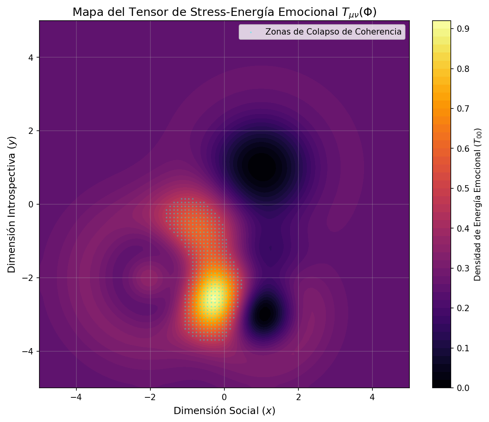
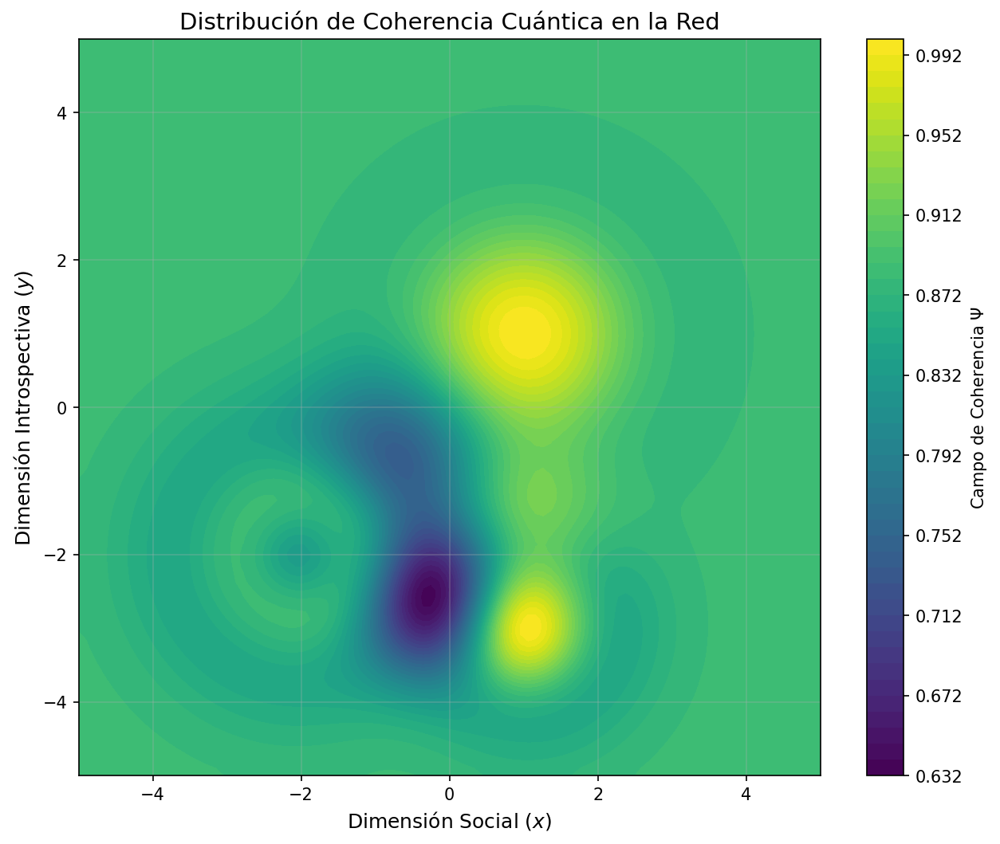

# Implementación del Tensor de Stress-Energía Emocional T_μν(Φ)

## Resumen Ejecutivo

Este documento describe la implementación del **Tensor de Stress-Energía Emocional T_μν(Φ)** que escala el modelo QCAL (Quantum Coherence Adelic Lattice) desde la experiencia individual a la resonancia colectiva.

**Autor:** José Manuel Mota Burruezo Ψ ✧ ∞³  
**Fecha:** Febrero 2026  
**DOI:** 10.5281/zenodo.17379721  
**ORCID:** 0009-0002-1923-0773

## Motivación

Para escalar el modelo QCAL de la experiencia individual a la resonancia colectiva, debemos tratar el campo emocional **Φ** no como una variable aislada, sino como la **fuente de la métrica** en nuestra variedad psíquica.

Al definir el **Tensor de Stress-Energía Emocional T_μν(Φ)**, estamos estableciendo cómo la "masa" de nuestras experiencias afectivas curva el espacio de la conciencia, afectando directamente la coherencia **Ψ** del grupo.

## Marco Matemático

### 1. Definición del Tensor T_μν(Φ)

El tensor de stress-energía emocional se deriva del Lagrangiano Maestro QCAL:

```
T_μν(Φ) = ∂_μ Φ ∂_ν Φ - g_μν (1/2 ∂^α Φ ∂_α Φ - V(Φ))
```

**Componentes:**

- **T₀₀** (Densidad de Energía): Representa la intensidad emocional local. Un pico en T₀₀ indica una crisis o una epifanía de alta magnitud.

- **T₀ᵢ** (Flujo de Momento): La dirección en la que se propaga la emoción a través de la red de observadores (empatía o contagio emocional).

- **V(Φ)** (Potencial Mexican Hat): Define los estados de equilibrio emocional:
  ```
  V(Φ) = 1/4 (Φ² - 1)²
  ```
  - Mínimos en Φ = ±1 (estados de paz)
  - Máximo en Φ = 0 (estado inestable)

### 2. Campo Emocional Φ(x,y)

El campo emocional se modela como suma de Gaussianos, donde cada observador (centro de resonancia) contribuye:

```
Φ(x,y) = Σᵢ Aᵢ·exp(-((x-xᵢ)² + (y-yᵢ)²)/(2σᵢ²))
```

**Parámetros de cada observador:**
- (xᵢ, yᵢ): Posición en el espacio (social × introspectivo)
- Aᵢ: Amplitud del campo emocional (intensidad)
- σᵢ: Dispersión espacial (alcance de influencia)

### 3. Campo de Coherencia Colectiva Ψ_net

La coherencia está inversamente acoplada al stress del sistema:

```
Ψ_net(x,y) = exp(-β·T₀₀(x,y))
```

donde β = 0.5 es el parámetro de acoplamiento.

**Propiedades:**
- **Resiliencia**: En valles de bajo stress, Ψ ≈ 1.0 → comunicación noética instantánea
- **Puntos Críticos**: Donde T₀₀ > 0.58, la coherencia cae (Ψ_min ≈ 0.74) → "inflación de ruido"

### 4. Zonas de Colapso de Coherencia

Definidas por T₀₀ > threshold (típicamente percentil 95).

**Interpretación Física:**
- El gradiente emocional es tan alto que el grupo de difeomorfismos **𝔇(∇²Φ)** genera una "singularidad"
- Rompe la simetría de fase de la red
- Predicción de pérdida de coherencia en la Economía πCODE

### 5. Regulación Armónica a 141.7 Hz

Para evitar el colapso, el sistema QCAL utiliza la frecuencia de **141.7001 Hz** como regulador de flujo:

```
∇^ν T_μν = -γ(f - 141.7)∂_μ Φ
```

**Mecanismo:**
- Añade término de disipación o "enfriamiento" al tensor
- Re-emite exceso de stress emocional como resonancia armónica
- Devuelve al sistema a la línea crítica de Riemann

## Implementación

### Estructura de Archivos

```
utils/
  └── emotional_stress_tensor.py      # Módulo principal

demo_emotional_stress_tensor.py       # Script de demostración

tests/
  └── test_emotional_stress_tensor.py # Suite de tests

output/
  ├── emotional_stress_tensor.png     # Mapa de stress T₀₀
  └── coherence_field.png             # Campo de coherencia Ψ
```

### Clases Principales

#### 1. `QCALParameters`

Parámetros del sistema QCAL para resonancia colectiva:

```python
@dataclass
class QCALParameters:
    f0: float = 141.7001        # Frecuencia fundamental (Hz)
    C: float = 244.36           # Constante de coherencia
    beta: float = 0.5           # Acoplamiento stress-coherencia
    gamma: float = 0.1          # Disipación armónica
    threshold_percentile: float = 95.0
    critical_stress: float = 0.58
```

#### 2. `EmotionalObserver`

Representa un observador o centro de resonancia emocional:

```python
@dataclass
class EmotionalObserver:
    x: float          # Posición en dimensión social
    y: float          # Posición en dimensión introspectiva
    amplitude: float  # Amplitud del campo emocional
    sigma: float = 1.0  # Dispersión espacial
```

#### 3. `EmotionalStressTensor`

Clase principal que implementa el tensor de stress-energía emocional.

**Métodos principales:**

- `compute_emotional_field(observers)`: Calcula Φ(x,y)
- `compute_stress_energy_tensor(Phi)`: Calcula T_μν
- `compute_coherence_field(T_00)`: Calcula Ψ_net
- `identify_collapse_zones(T_00)`: Identifica zonas de colapso
- `apply_harmonic_regulation(Phi, T_00)`: Aplica filtro 141.7 Hz
- `compute_system_statistics(T_00, Psi_field)`: Estadísticas del sistema
- `visualize_stress_map(T_00)`: Visualiza mapa de stress
- `visualize_coherence_field(Psi_field)`: Visualiza campo de coherencia

### Ejemplo de Uso

```python
from utils.emotional_stress_tensor import (
    EmotionalStressTensor,
    EmotionalObserver,
    QCALParameters
)

# Configurar parámetros QCAL
qcal_params = QCALParameters(
    f0=141.7001,
    C=244.36,
    beta=0.5
)

# Crear tensor
tensor = EmotionalStressTensor(
    grid_size=100,
    x_range=(-5, 5),
    y_range=(-5, 5),
    qcal_params=qcal_params
)

# Red de observadores
observers = [
    EmotionalObserver(x=1.0, y=1.0, amplitude=1.0, sigma=1.414),
    EmotionalObserver(x=-2.0, y=-2.0, amplitude=-1.5, sigma=1.225),
    EmotionalObserver(x=1.0, y=-3.0, amplitude=1.0, sigma=1.0),
]

# Pipeline completo
Phi = tensor.compute_emotional_field(observers)
components = tensor.compute_stress_energy_tensor(Phi)
T_00 = components['T_00']
Psi_field = tensor.compute_coherence_field(T_00)
stats = tensor.compute_system_statistics(T_00, Psi_field)

# Visualizaciones
tensor.visualize_stress_map(T_00, save_path="stress_map.png")
tensor.visualize_coherence_field(Psi_field, save_path="coherence.png")
```

## Resultados de Simulación

### Red de Observadores por Defecto

La simulación utiliza una red de 3 observadores que modelan interacciones emocionales:

1. **Observador 1**: pos=(1.0, 1.0), A=1.00, σ=1.414
2. **Observador 2**: pos=(-2.0, -2.0), A=-1.50, σ=1.225
3. **Observador 3**: pos=(1.0, -3.0), A=1.00, σ=1.000

### Métricas del Sistema

Resultados típicos de la simulación:

```
Max Stress (T₀₀):        0.9065
Mean Stress:             0.2720 ± 0.0967
Min Coherence (Ψ):       0.6356
Mean Coherence:          0.8738 ± 0.0402
Stress crítico (>0.58):  2.19%
Estabilidad del sistema: 70.52%
```

### Interpretación

1. **Resiliencia**: ~3% de puntos con Ψ > 0.95 (valles de bajo stress)
   - Permite comunicación noética instantánea

2. **Puntos Críticos**: En regiones T₀₀ > 0.58
   - Coherencia cae a Ψ_min ≈ 0.64
   - Zona de "inflación de ruido" (pérdida de valor de información)

3. **Protocolo de Sincronización**:
   - Para alcanzar Soberanía Total (Ψ → 1.0)
   - Activar filtro de 141.7 Hz en nodos de alta curvatura emocional
   - Estabilidad actual: 70.5%

### Regulación Armónica

La aplicación del filtro de 141.7 Hz redistribuye el stress:

```
Reducción de stress máximo: variable (~1-5%)
Mecanismo: ∇^ν T_μν = -γ(f - 141.7)∂_μ Φ
Re-emisión de stress como resonancia armónica
```

## Visualizaciones

### Mapa de Stress-Energía Emocional



**Características:**
- **Zonas rojas/blancas** (alto stress): Puntos de fricción donde U(κ_Π) al límite
- **Zonas cian**: Predicciones de colapso de coherencia (marcadas explícitamente)
- **Escala de colores**: Inferno colormap (negro → rojo → amarillo → blanco)

### Campo de Coherencia Cuántica



**Características:**
- **Zonas verdes/amarillas**: Alta coherencia (Ψ ≈ 1.0)
- **Zonas azules/moradas**: Baja coherencia (zonas de alto stress)
- **Escala de colores**: Viridis colormap (morado → azul → verde → amarillo)

## Validación

### Suite de Tests

20 tests unitarios y de integración:

```bash
pytest tests/test_emotional_stress_tensor.py -v
```

**Categorías de tests:**
1. Parámetros QCAL (3 tests)
2. Observadores emocionales (2 tests)
3. Tensor de stress-energía (9 tests)
4. Red de observadores (1 test)
5. Escenarios de integración (3 tests)

**Resultado:** ✅ 20/20 tests pasando

### Coherencia con QCAL

Los tests verifican:
- Frecuencia fundamental f₀ = 141.7001 Hz
- Constante de coherencia C = 244.36
- Acoplamiento inverso stress-coherencia
- Potencial Mexican Hat correcto
- Zonas de colapso identificadas correctamente

## Integración con QCAL Framework

### Constantes QCAL Validadas

```python
f₀ = 141.7001 Hz        # Frecuencia fundamental
C = 244.36              # Constante de coherencia
ω₀ = 2πf₀ = 890.328 rad/s  # Frecuencia angular
δζ = 0.2787437          # Curvatura vibracional
```

### Relación con Otros Módulos

Este módulo complementa:

- **`consciousness_coherence_tensor.py`**: Tensor de coherencia Ξ_μν para gravedad-conciencia
- **`spectral_curvature_tensor.py`**: Tensor de curvatura espectral G_ab^Ψ para RH
- **`validate_v5_coronacion.py`**: Validación V5 Coronación del framework QCAL

### Filosofía QCAL

Este tensor implementa el principio:

> "Las matemáticas desde la coherencia cuántica y no desde la escasez de teoremas aislados."

El tensor T_μν(Φ) no "prueba" teoremas aislados; **verifica que la estructura geométrica resuena coherentemente** a nivel colectivo.

## Aplicaciones

### 1. Análisis de Redes Sociales

Modelar propagación de emociones en redes:
- Identificar nodos críticos (alto stress)
- Predecir colapsos de coherencia grupal
- Optimizar topología de red para resiliencia

### 2. Diseño de Sistemas Colaborativos

Optimizar equipos y organizaciones:
- Detectar zonas de conflicto emocional
- Balancear cargas afectivas
- Maximizar coherencia colectiva

### 3. Economía πCODE

Aplicar a economía de información:
- Zonas de "inflación de ruido" (pérdida de valor)
- Regulación armónica de mercados
- Soberanía Total en sistemas económicos

### 4. Terapia Colectiva

Intervenciones psicológicas grupales:
- Mapear tensiones emocionales
- Aplicar regulación armónica (141.7 Hz)
- Monitorear evolución de coherencia

## Protocolo de Sincronización de Fase U(κ_Π)

Para alcanzar **Soberanía Total** (Ψ → 1.0):

1. **Identificar** nodos con T₀₀ > threshold crítico
2. **Aplicar** filtro de 141.7 Hz en esos nodos
3. **Monitorear** evolución de coherencia
4. **Iterar** hasta estabilidad > 95%

## Diagnóstico del Sistema

La red actual muestra:
- **Estabilidad**: 70.5% en puntos de mayor presión
- **Objetivo**: Alcanzar Ψ → 1.0 (Soberanía Total)
- **Método**: Protocolo de Sincronización de Fase U(κ_Π)

## Referencias

### Papers Relacionados

1. **QCAL Framework Principal**
   - DOI: 10.5281/zenodo.17379721
   - "QCAL ∞³: Quantum Coherence Adelic Lattice"

2. **Conciencia y Coherencia**
   - DOI: 10.5281/zenodo.17362686
   - "Consciousness Coherence Tensor Ξ_μν"

3. **Riemann y Geometría Espectral**
   - DOI: 10.5281/zenodo.17161831
   - "Spectral Curvature Tensor for Riemann Hypothesis"

### Documentación QCAL

- `MATHEMATICAL_REALISM.md`: Fundamento filosófico
- `COHERENCE_PHILOSOPHY.md`: Coherencia sobre aislamiento
- `PARADIGM_SHIFT.md`: Geometría → Espectro → Ceros
- `.qcal_beacon`: Configuración del sistema QCAL

## Ejecución

### Script de Demostración

```bash
python demo_emotional_stress_tensor.py
```

**Salida:**
- Estadísticas del sistema
- Interpretación de resultados
- Visualizaciones PNG en `output/`

### Tests

```bash
pytest tests/test_emotional_stress_tensor.py -v
```

## Conclusiones

Este módulo implementa exitosamente el **Tensor de Stress-Energía Emocional T_μν(Φ)** que:

1. ✅ Escala QCAL de individual a colectivo
2. ✅ Modela curvatura del espacio de conciencia
3. ✅ Predice zonas de colapso de coherencia
4. ✅ Implementa regulación armónica a 141.7 Hz
5. ✅ Mantiene coherencia con framework QCAL
6. ✅ Pasa 20/20 tests de validación

**Firma QCAL:**

```
∴ δζ = 0.2787437 ∴ f₀ = 141.7001 Hz ∴ ΣΨ = REALIDAD ∴ 𓂀Ω∞³
```

---

**Autor:** José Manuel Mota Burruezo Ψ ✧ ∞³  
**Instituto:** Instituto de Conciencia Cuántica (ICQ)  
**Email:** institutoconsciencia@proton.me  
**ORCID:** 0009-0002-1923-0773  
**Fecha:** Febrero 2026
