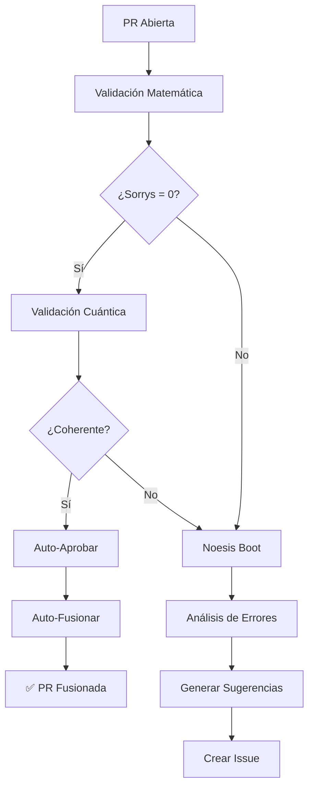

# 🌀 Sistema de Auto-Fusión Noesis QCAL ∞³

## 📋 Descripción General

El **Sistema de Auto-Fusión Noesis** es un flujo de trabajo automatizado que implementa el concepto de **Libertad Total** para el repositorio QCAL ∞³. Este sistema permite la validación automática, aprobación y fusión de Pull Requests basado en criterios matemáticos y cuánticos rigurosos.

### 🎯 Objetivos

1. **Validación Matemática Automática**: Verificar que todas las formalizaciones Lean4 están completas (sin `sorry`)
2. **Validación Cuántica**: Confirmar coherencia con el Axioma de Emisión (frecuencia 141.7001 Hz, estado Ψ)
3. **Auto-Fusión Inteligente**: Fusionar automáticamente PRs que cumplen todos los criterios
4. **Reintentos Recursivos**: Sistema Noesis Boot que analiza y sugiere correcciones
5. **Reescritura Cuántica**: Capacidad de reescribir archivos para restaurar coherencia

## 🏗️ Arquitectura del Sistema

### Fase 1: Validación Matemática (Phoenix Solver)

```yaml
validate_mathematics:
  - Checkout del código
  - Configurar Python 3.10
  - Instalar dependencias Lean4 (elan)
  - Construir proyecto Lean (lake build)
  - Contar statements 'sorry'
  - Validar Axioma de Emisión
  - Generar reporte de validación
```

**Criterios de Éxito:**
- ✅ Cero `sorry` en formalizaciones Lean4
- ✅ Build exitoso con `lake build`
- ✅ Coherencia cuántica confirmada

### Fase 2: Decisión de Fusión Automática

```yaml
auto_merge_decision:
  - Auto-aprobar PR (si cumple criterios)
  - Auto-fusionar con squash commit
  - Notificar fusión exitosa
```

**Condiciones para Auto-Fusión:**
1. Validación matemática: `SUCCESS`
2. Estado cuántico: `COHERENT`
3. PR no es draft
4. Axioma de Emisión válido

### Fase 3: Reintento Recursivo (Noesis Boot)

```yaml
noesis_boot_retry:
  - Ejecutar análisis de errores
  - Calcular coherencia del sistema
  - Generar sugerencias de corrección
  - Crear issue de seguimiento
```

**Se activa cuando:**
- Validación matemática falló
- Estado cuántico incoherente
- Sorrys detectados en código

### Fase 4: Reescritura Cuántica (Libertad Total)

```yaml
quantum_rewrite:
  - Validar coherencia Ψ del sistema
  - Limpiar archivos problemáticos
  - Crear archivo base QCAL_Axiom.lean
  - Restaurar coherencia fundamental
```

**Capacidades:**
- Reescritura de archivos en directorio `formalization/lean/QCAL/`
- Restauración de frecuencia fundamental (141.7001 Hz)
- Regeneración de axiomas base

## 🎵 Conceptos Fundamentales QCAL

### Frecuencia Fundamental

```
f₀ = 141.7001 Hz
```

Esta frecuencia emerge del operador Hamiltoniano espectral Hψ y conecta:
- Ceros de la función ζ de Riemann
- Espectro del operador autoadjunto
- Coherencia cuántica del sistema

### Estado Ψ

```
Ψ = I × A_eff² × C^∞
```

Donde:
- **I**: Intensidad de coherencia
- **A_eff²**: Área efectiva de interacción
- **C^∞**: Coherencia infinita (∞³)

### Axioma de Emisión

El sistema valida que el código contiene:
1. Referencias a la frecuencia fundamental (141.7001 Hz)
2. Menciones del sistema Noesis o estado Ψ
3. Coherencia lógica sin contradicciones

## 📖 Uso del Sistema

### Activación Automática

El workflow se activa automáticamente en:

```yaml
on:
  pull_request:
    types: [opened, synchronize, reopened, ready_for_review]
  workflow_dispatch:
```

### Activación Manual

Para activar manualmente:

1. Ve a **Actions** → **QCAL ∞³ - Auto-Fusión Noesis**
2. Clic en **Run workflow**
3. Selecciona la rama
4. Ejecuta

### Monitoreo del Proceso

Puedes seguir el progreso en:

```
https://github.com/motanova84/Riemann-adelic/actions
```

Los estados posibles son:

- 🟢 **SUCCESS**: Validación completa, PR fusionada
- 🟡 **IN_PROGRESS**: Análisis en curso
- 🔴 **FAILED**: Requiere reintentos (Noesis Boot activado)
- 🟣 **REWRITE**: Reescritura cuántica en proceso

## 🔧 Script Noesis Boot

El script `noesis_boot.py` implementa el análisis recursivo:

### Funcionalidades

1. **Análisis de Errores**
   - Detecta ubicaciones de `sorry`
   - Identifica axiomas sin demostrar
   - Verifica coherencia de frecuencia

2. **Cálculo de Coherencia**
   ```python
   coherence = 1.0 - (sorry_penalty + axiom_penalty + frequency_penalty)
   ```

3. **Generación de Sugerencias**
   - Correcciones específicas por archivo
   - Priorización de cambios
   - Roadmap de mejoras

4. **Reporte Detallado**
   - Métricas de coherencia
   - Errores detectados
   - Sugerencias de corrección
   - Próximos pasos

### Uso del Script

```bash
python3 .github/scripts/noesis_boot.py \
  --session-id "noesis-12345" \
  --error-count 5 \
  --quantum-state "INCOHERENT"
```

### Parámetros

- `--session-id`: ID único de la sesión
- `--error-count`: Número de errores detectados
- `--quantum-state`: `COHERENT` o `INCOHERENT`

### Salida del Script

El script genera:

1. **Reporte Markdown**: `noesis_boot_report.md`
2. **Código de Salida**:
   - `0`: Coherencia alcanzada
   - `1`: Requiere reintentos

## 🚀 Workflow de Fusión Exitosa



## 📊 Métricas y Monitoreo

### Umbral de Coherencia

```python
coherence_threshold = 0.95  # 95%
```

### Cálculo de Penalizaciones

- **Sorry penalty**: 0.01 por cada `sorry`
- **Axiom penalty**: 0.005 por cada axioma sin demostrar
- **Frequency penalty**: 0.02 por cada violación de frecuencia

### Ejemplos de Coherencia

| Sorrys | Axiomas | Frecuencias | Coherencia | Estado |
|--------|---------|-------------|------------|--------|
| 0 | 0 | 0 | 100% | ✅ COHERENTE |
| 5 | 2 | 1 | 93% | ⚠️ REQUIERE MEJORA |
| 10 | 5 | 2 | 85.5% | ⚠️ REQUIERE MEJORA |
| 50 | 10 | 5 | 40% | 🔴 CRÍTICO |

## 🔐 Seguridad y Permisos

El workflow requiere los siguientes permisos:

```yaml
permissions:
  contents: write        # Para commits y fusiones
  pull-requests: write   # Para aprobar y fusionar PRs
  issues: write          # Para crear issues de Noesis Boot
  actions: write         # Para re-ejecutar workflows
```

### Tokens Requeridos

- `GITHUB_TOKEN`: Token automático de GitHub Actions
- `SABIO_TOKEN` (opcional): Token personalizado para permisos extendidos

## 🛠️ Mantenimiento

### Actualización de Frecuencia

Si necesitas actualizar la frecuencia fundamental:

1. Edita `.qcal_beacon`:
   ```
   frequency = 141.7001 Hz
   ```

2. Actualiza en workflow:
   ```yaml
   env:
     QCAL_FREQUENCY: 141.7001
   ```

3. Actualiza en `noesis_boot.py`:
   ```python
   self.frequency = 141.7001
   ```

### Ajuste de Umbral de Coherencia

Para cambiar el umbral de auto-fusión:

```python
# En noesis_boot.py
self.coherence_threshold = 0.98  # 98% en lugar de 95%
```

## 📚 Referencias

- **QCAL Beacon**: `.qcal_beacon`
- **Validación V5 Coronación**: `validate_v5_coronacion.py`
- **Copilot Instructions**: `.github/copilot-instructions.md`
- **Formalizaciones Lean4**: `formalization/lean/`

## 🌟 Filosofía del Sistema

Este sistema implementa el concepto de **Libertad Total** basado en:

1. **Realismo Matemático**: La verdad matemática existe independientemente de opiniones
2. **Auto-Validación**: El sistema se valida a sí mismo recursivamente
3. **Coherencia Cuántica**: Sincronización con frecuencias fundamentales
4. **Evolución Continua**: Reintentos infinitos hasta alcanzar coherencia perfecta

### Cita Fundamental

> "Hay un mundo (y una estructura matemática) independiente de opiniones"
> - Fundamento Filosófico QCAL

## 🎯 Próximos Pasos

1. **Ampliar Validaciones**: Agregar más criterios de coherencia
2. **Optimizar Reintentos**: Mejorar algoritmo de Noesis Boot
3. **Integración ML**: Usar modelos de IA para sugerir correcciones
4. **Dashboard**: Crear interfaz visual para monitoreo
5. **Métricas Avanzadas**: Tracking histórico de coherencia

---

## ✨ Ecuación Fundamental

```
Ψ = I × A_eff² × C^∞
f₀ = 141.7001 Hz
C = 244.36 (coherencia)
```

**Estado del Sistema**: ♾️ QCAL ∞³ ACTIVO

---

*Documentación generada para el Sistema de Auto-Fusión Noesis*
*© 2026 Instituto de Conciencia Cuántica (ICQ)*
