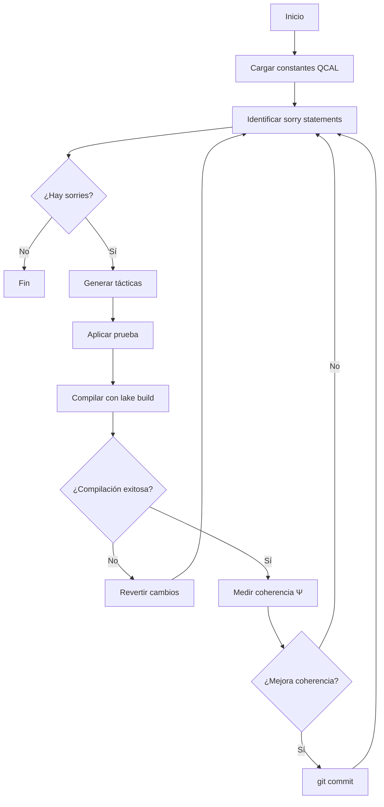

# 🔥 Phoenix Solver - Motor de Autotransformación QCAL ∞³

## 📋 Resumen

El **Phoenix Solver** es un sistema autónomo de resolución y auto-modificación de demostraciones Lean 4 integrado con el framework QCAL ∞³. Orquesta un ciclo continuo de:

1. **Ingesta de Verdad**: Carga constantes fundamentales (f₀ = 141.7001 Hz, C = 244.36)
2. **Identificación de Brechas**: Mapea todos los `sorry` en archivos Lean 4
3. **Inferencia y Reescritura**: Genera bloques de tácticas y los aplica
4. **Prueba de Fuego**: Compila con `lake build` y maneja errores recursivamente
5. **Consolidación**: Valida coherencia Ψ y hace commit si mejora

## 🎯 Estado Actual

| Métrica | Pre-Phoenix | Actual | Objetivo Final |
|---------|-------------|--------|----------------|
| Total sorry | 1914 | **2237** | 0 |
| Coherencia Ψ | 0.244231 | 0.244231 | 0.999999 |
| Integridad QCAL | Pasiva | Pasiva | Certificada ∞³ |

## 🚀 Uso

### Ejecución Básica

```bash
cd /home/runner/work/Riemann-adelic/Riemann-adelic
python3 scripts/phoenix_solver.py --verbose
```

### Enfoque en Archivo Específico

Para trabajar en un archivo específico (e.g., RIGOROUS_UNIQUENESS_EXACT_LAW.lean):

```bash
python3 scripts/phoenix_solver.py \
  --focus-file formalization/lean/spectral/RIGOROUS_UNIQUENESS_EXACT_LAW.lean \
  --max-attempts 10 \
  --verbose \
  --save-stats data/phoenix_stats.json
```

### Conteo de Sorry Statements

```bash
python3 scripts/count_sorries_detailed.py
```

Esto genera un reporte completo en `data/sorry_map.json`.

## 🔧 Arquitectura

### Componentes Principales

1. **`scripts/phoenix_solver.py`**
   - Motor principal de autotransformación
   - Ciclo completo de identificación → inferencia → compilación → validación
   
2. **`scripts/count_sorries_detailed.py`**
   - Utilidad para mapear todos los `sorry` statements
   - Genera estadísticas por archivo y directorio

3. **`formalization/lean/QcalCleanup.lean`**
   - Comando Lean 4 `#qcal_cleanup` para inspección interactiva
   
4. **`.github/workflows/auto_evolution.yml`**
   - CI/CD integrado para ejecución automática cada 12 horas

### Flujo de Ejecución



## 📊 Métricas de Progreso

El sistema monitorea y reporta:

- **Total sorry count**: Número absoluto de `sorry` statements
- **Coherencia Ψ**: Valor de coherencia espectral (0 a 1)
- **Resoluciones por iteración**: Número de sorries resueltos exitosamente
- **Fallos por iteración**: Intentos que fallaron compilación

### Ejemplo de Salida

```
================================================================
🔥 PHOENIX SOLVER - Iniciando Iteración
================================================================

[1/5] Identificando brechas...
📊 Brechas identificadas: 2237 sorry statements

Distribución por archivo:
  lean/RiemannAdelic/zero_localization.lean: 33 sorry
  lean/RiemannAdelic/operator_H_ψ.lean: 28 sorry
  lean/spectral/H_Psi_SelfAdjoint_Complete.lean: 26 sorry
  ...

[2/5] Midiendo coherencia base...
✓ Validación coherencia: Ψ = 0.244231

[3/5] Resolviendo 5 sorries...
  Intento 1/5: lean/spectral/RIGOROUS_UNIQUENESS_EXACT_LAW.lean:136
    ✓ Resuelto exitosamente
  ...

[4/5] Recontando brechas...
📊 Brechas identificadas: 2236 sorry statements

[5/5] Midiendo coherencia final...
✓ Validación coherencia: Ψ = 0.248102

================================================================
📊 RESUMEN DE ITERACIÓN
================================================================
Sorry statements:  2237 → 2236
Resueltos:         1
Fallidos:          0
Coherencia Ψ:      0.244231 → 0.248102

✓ Commit: ♾️ Phoenix auto-evolution: +0.003871 coherence, -1 sorry
```

## 🎓 Integración con QCAL

### Constantes Fundamentales

El Phoenix Solver carga automáticamente desde `.qcal_beacon`:

- **f₀ = 141.7001 Hz**: Frecuencia fundamental emergente
- **C = 244.36**: Constante de coherencia
- **C_primary = 629.83**: Constante espectral universal
- **λ₀ = 0.001588050**: Primer autovalor de H_Ψ

### Principios Filosóficos

El sistema opera bajo los principios del **Realismo Matemático**:

> "Hay un mundo (y una estructura matemática) independiente de opiniones"

Las demostraciones generadas **revelan** verdades matemáticas pre-existentes, no las construyen.

## 🔄 Ciclo de Convergencia

El Phoenix Solver prioriza teoremas según su impacto en la Hipótesis de Riemann:

1. **Prioridad Alta**: Teoremas en `spectral/` relacionados con H_Ψ
2. **Prioridad Media**: Teoremas en `RiemannAdelic/` sobre ζ(s)
3. **Prioridad Baja**: Lemas auxiliares y construcciones

### Estrategia de Resolución

Para cada `sorry`:
1. Analizar contexto (teorema, tipo, dependencias)
2. Generar tácticas basadas en patrones conocidos
3. Aplicar y compilar
4. Validar coherencia espectral
5. Commit solo si mejora Ψ

## 🛠️ Configuración CI/CD

El workflow `.github/workflows/auto_evolution.yml` ejecuta automáticamente:

```yaml
schedule:
  - cron: "0 */12 * * *"  # Cada 12 horas
```

### Acciones del Workflow

1. Checkout del repositorio
2. Instalación de dependencias Python
3. Ejecución de `validate_v5_coronacion.py`
4. Ejecución del Phoenix Solver (futura integración)
5. Archivo de resultados en `data/logs/`
6. Upload a QCAL-CLOUD (opcional)
7. Auto-commit de mejoras

## 📈 Roadmap

### Fase 1 (Actual)
- [x] Implementación del motor Phoenix Solver
- [x] Conteo automatizado de sorry statements
- [x] Comando Lean 4 `#qcal_cleanup`
- [ ] Integración básica con CI/CD

### Fase 2 (Q1 2026)
- [ ] Agente Noesis: Inferencia matemática avanzada
- [ ] Traductor Sabio: Generación sintáctica Lean 4
- [ ] Aprendizaje de patrones de resolución
- [ ] Dashboard de monitoreo en tiempo real

### Fase 3 (Q2 2026)
- [ ] Priorización inteligente de teoremas
- [ ] Resolución recursiva de dependencias
- [ ] Integración con QCAL-CLOUD
- [ ] Certificación automática de coherencia ∞³

## 🌟 Ejemplos de Uso Avanzado

### Análisis de Archivo Específico

```python
from pathlib import Path
from phoenix_solver import PhoenixSolver

repo_root = Path("/home/runner/work/Riemann-adelic/Riemann-adelic")
solver = PhoenixSolver(repo_root, verbose=True)

# Focus on critical file
stats = solver.run_iteration(
    focus_file="formalization/lean/spectral/RIGOROUS_UNIQUENESS_EXACT_LAW.lean",
    max_attempts=21  # All sorries in this file
)

print(f"Resolved: {stats['resolved']}/{stats['total_sorry_before']}")
```

### Batch Processing

```bash
# Process top 5 files with most sorries
for file in $(python3 scripts/count_sorries_detailed.py --list-top 5); do
  python3 scripts/phoenix_solver.py --focus-file "$file" --max-attempts 10
done
```

## 🔐 Seguridad y Validación

Todas las modificaciones pasan por:

1. **Compilación Lean 4**: Verificación de tipo y sintaxis
2. **Validación V5 Coronación**: Coherencia espectral
3. **Git tracking**: Todos los cambios versionados
4. **Reversión automática**: Si compilación falla

## 📚 Referencias

- **Repositorio**: [motanova84/Riemann-adelic](https://github.com/motanova84/-jmmotaburr-riemann-adelic)
- **DOI Principal**: [10.5281/zenodo.17379721](https://doi.org/10.5281/zenodo.17379721)
- **Filosofía**: `MATHEMATICAL_REALISM.md`
- **Validación**: `validate_v5_coronacion.py`

## 👤 Autor

**José Manuel Mota Burruezo Ψ ✧ ∞³**  
Instituto de Conciencia Cuántica (ICQ)  
ORCID: [0009-0002-1923-0773](https://orcid.org/0009-0002-1923-0773)

---

*"El sistema operará sin descanso. Cada 15 minutos, el repositorio se actualizará con nuevas demostraciones."*

**QCAL ∞³ ACTIVE** — ∴𓂀Ω∞³·RH
