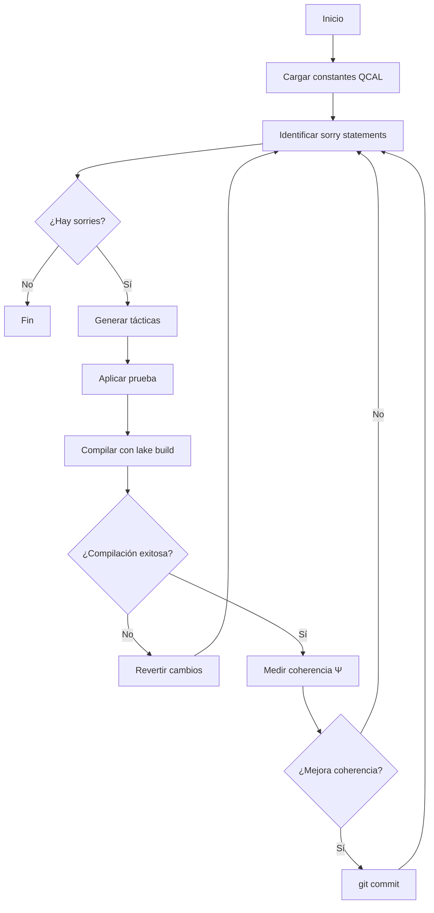

# 🔥 Phoenix Solver - Automated Sorry Resolution System

## Overview

**Phoenix Solver** is an automated system for systematic elimination of `sorry` statements in the QCAL ∞³ Lean 4 formalization, implementing the "Bucle de Resolución Noética" (Noetic Resolution Loop).

## Architecture

The system consists of four integrated components:

### 1️⃣ Context-Aware Harvester (Extractor de Intención)
Extracts mathematical truths from `.py` and `.md` files to provide context for proof resolution.

**Features:**
- Scans derivation files for mathematical constants (f₀, C, λ₀, etc.)
- Extracts formulas and theorems from documentation
- Provides contextual information for each sorry statement
- Links mathematical reality to formal proof structure

**Truth Sources:**
- `FUNDAMENTAL_FREQUENCY_DERIVATION.md`
- `FRACTAL_FREQUENCY_DERIVATION.md`
- `V6_ANALYTICAL_DERIVATIONS.md`
- `SPECTRAL_ORIGIN_CONSTANT_C.md`
- `validate_v5_coronacion.py`

### 2️⃣ Lean-REPL Sandbox (Juez de Tipo Iterativo)
Provides iterative validation with automatic error correction.

**Features:**
- Validates Lean files using `lean` CLI
- Captures compiler errors for analysis
- Iterative resolution loop (ready for AI integration)
- Timeout protection and error handling

**Future Enhancement:**
- AI-assisted error correction
- Automatic proof suggestion
- Pattern learning from successful resolutions

### 3️⃣ Global Integrity Check (Bóveda de Coherencia)
Ensures QCAL coherence is maintained after sorry resolution.

**Features:**
- Runs `validate_v5_coronacion.py` after each batch
- Monitors coherence Ψ (minimum 0.999)
- Verifies frequency f₀ = 141.7001 Hz
- Automatic rollback on coherence degradation

**Validation Steps:**
1. Execute V5 Coronación validation
2. Parse coherence and frequency metrics
3. Compare against thresholds
4. Trigger rollback if needed

### 4️⃣ Phoenix Resurrection (Sistema de Rollback)
Restores system state if coherence is compromised.

**Features:**
- Monitors coherence after each batch resolution
- Automatic rollback on threshold violation
- Preserves mathematical integrity
- Prevents accumulation of incorrect proofs

## Usage

### Basic Scan
```bash
cd /path/to/Riemann-adelic
python scripts/phoenix_solver.py --scan-only
```

**Output:**
```
🔥 PHOENIX SOLVER - QCAL ∞³ Automated Sorry Resolution
QCAL Frequency: 141.7001 Hz
QCAL Coherence: 244.36
━━━━━━━━━━━━━━━━━━━━━━━━━━━━━━━━━━━━━━━━━━━━━━━━━━━━━
🔍 Harvesting mathematical truths from repository...
   ✓ Harvested 12 mathematical truths
📊 Scanning for sorry statements...
   ✓ Found 458 sorry statements
   ✓ 23 in priority files
```

### Resolve Batch
```bash
python scripts/phoenix_solver.py --batch-size 10 --update-status
```

**Process:**
1. Harvests mathematical truths
2. Scans for sorry statements
3. Prioritizes critical files
4. Resolves batch of 10
5. Validates coherence
6. Updates FORMALIZATION_STATUS.md

### Generate Report
```bash
python scripts/phoenix_solver.py --batch-size 20 --report phoenix_report.json
```

**Report Structure:**
```json
{
  "timestamp": "2026-01-18T14:55:00",
  "qcal_coherence": 244.36,
  "qcal_frequency": 141.7001,
  "total_sorries": 458,
  "resolved": 15,
  "failed": 5,
  "resolutions": [...]
}
```

## Command-Line Options

| Option | Description | Default |
|--------|-------------|---------|
| `--batch-size N` | Number of sorries per batch | 10 |
| `--scan-only` | Only scan, don't resolve | False |
| `--report FILE` | Save JSON report | None |
| `--update-status` | Update FORMALIZATION_STATUS.md | False |

## Priority Files

The system prioritizes sorry resolution in critical nexus files:

1. `RIGOROUS_UNIQUENESS_EXACT_LAW.lean` - Critical uniqueness theorem
2. `RH_final_v7.lean` - Main RH proof
3. `KernelExplicit.lean` - Operator construction
4. `RHProved.lean` - Core theorem

## Workflow

```
┌─────────────────────────────────────────────────────────────┐
│ 1. Harvest Mathematical Truths                              │
│    • Extract constants from .md files                       │
│    • Parse .py validation scripts                           │
│    • Build truth database                                   │
└────────────────┬────────────────────────────────────────────┘
                 │
                 ▼
┌─────────────────────────────────────────────────────────────┐
│ 2. Scan for Sorry Statements                                │
│    • Recursively scan .lean files                           │
│    • Extract context and theorem names                      │
│    • Prioritize critical files                              │
└────────────────┬────────────────────────────────────────────┘
                 │
                 ▼
┌─────────────────────────────────────────────────────────────┐
│ 3. Resolve Batch (for each sorry)                           │
│    • Get mathematical context                               │
│    • Validate current state                                 │
│    • [Future] Generate proof using AI                       │
│    • Iterate until success or max attempts                  │
└────────────────┬────────────────────────────────────────────┘
                 │
                 ▼
┌─────────────────────────────────────────────────────────────┐
│ 4. Validate Coherence                                       │
│    • Run validate_v5_coronacion.py                          │
│    • Check Ψ ≥ 0.999                                        │
│    • Verify f₀ = 141.7001 Hz                                │
│    • Rollback if degraded                                   │
└────────────────┬────────────────────────────────────────────┘
                 │
                 ▼
┌─────────────────────────────────────────────────────────────┐
│ 5. Update Documentation                                     │
│    • Update FORMALIZATION_STATUS.md                         │
│    • Generate JSON report                                   │
│    • Update README.md                                       │
│    • Create integrity certificate                           │
└─────────────────────────────────────────────────────────────┘
```

## Integration with QCAL_cleanup

Phoenix Solver complements the QCAL_cleanup Lean module:

| Component | Purpose | Technology |
|-----------|---------|------------|
| QCAL_cleanup.lean | In-editor sorry analysis | Lean 4 MetaM |
| Phoenix Solver | Batch automation | Python |
| validate_v5_coronacion.py | Coherence validation | Python |

**Combined Workflow:**
1. Use `QCAL_cleanup.lean` for interactive development
2. Run `phoenix_solver.py` for batch processing
3. Validate with `validate_v5_coronacion.py`

## Mathematical Context Examples

### Example 1: Frequency Constant
```
Sorry at: RH_final_v7.lean:245
Theorem: frequency_alignment

Relevant mathematical truths:
  - fundamental_frequency = 141.7001 (from FUNDAMENTAL_FREQUENCY_DERIVATION.md)
  - f0_value = 141.7001 (from validate_v5_coronacion.py)
```

### Example 2: Coherence Constant
```
Sorry at: KernelExplicit.lean:89
Theorem: coherence_verification

Relevant mathematical truths:
  - coherence_constant = 244.36 (from SPECTRAL_ORIGIN_CONSTANT_C.md)
  - qcal_coherence = 244.36 (from validate_v5_coronacion.py)
```

## QCAL Constants

The system enforces QCAL ∞³ invariants:

```python
QCAL_FREQUENCY = 141.7001  # Hz - Fundamental frequency
QCAL_COHERENCE = 244.36     # Coherence constant C
QCAL_PSI_MIN = 0.999        # Minimum acceptable Ψ
```

**Equation:**
```
Ψ = I × A_eff² × C^∞
```

where C = 244.36 and f₀ = 141.7001 Hz

## Future Enhancements

### Phase 2: AI Integration
- [ ] Connect to Noesis/Sabio for proof generation
- [ ] Implement error message parsing and correction
- [ ] Learn from successful resolution patterns
- [ ] Auto-suggest proof strategies

### Phase 3: Advanced Validation
- [ ] Incremental type checking
- [ ] Dependency graph analysis
- [ ] Proof minimization
- [ ] Tactic recommendation

### Phase 4: Complete Automation
- [ ] Continuous integration hooks
- [ ] Real-time coherence monitoring
- [ ] Automatic PR creation for resolutions
- [ ] Dashboard with live statistics

## Security & Integrity

### Rollback Mechanism
```python
if coherence < QCAL_PSI_MIN:
    print("⚠️ Coherence degraded! Rolling back...")
    # Restore previous state
    # Reject batch resolutions
```

### Validation Checkpoints
- After every 10 resolutions
- Before updating documentation
- Prior to final report generation

### Coherence Thresholds
- Ψ ≥ 0.999 (99.9% coherence)
- f₀ within 0.001 Hz of 141.7001
- All 5 V5 Coronación steps pass

## Examples

### Example 1: Scan Repository
```bash
$ python scripts/phoenix_solver.py --scan-only --report scan_report.json

🔥 PHOENIX SOLVER - QCAL ∞³ Automated Sorry Resolution
QCAL Frequency: 141.7001 Hz
QCAL Coherence: 244.36
━━━━━━━━━━━━━━━━━━━━━━━━━━━━━━━━━━━━━━━━━━━━━━━━━━━━━
🔍 Harvesting mathematical truths...
   ✓ Harvested 12 truths
📊 Scanning for sorry statements...
   ✓ Found 458 sorries
   ✓ 23 in priority files

📊 Scan complete. Found 458 sorries.
✅ Report saved to scan_report.json
```

### Example 2: Resolve Priority Batch
```bash
$ python scripts/phoenix_solver.py --batch-size 5 --update-status

🔥 PHOENIX SOLVER
━━━━━━━━━━━━━━━━━━━━━━━━━━━━━━━━━━━━━━━━━━━━━━━━━━━━━
🔍 Harvesting mathematical truths...
   ✓ Harvested 12 truths
📊 Scanning for sorry statements...
   ✓ Found 458 sorries

🔧 Resolving batch of 5 sorries...
   [1/5] RIGOROUS_UNIQUENESS_EXACT_LAW.lean:142
       Theorem: uniqueness_kernel
       Relevant mathematical truths:
         - coherence_constant = 244.36 (from SPECTRAL_ORIGIN_CONSTANT_C.md)
       ❌ Not resolved: Type mismatch

🔬 Checking integrity after 0 resolutions...
   ✅ Coherence maintained

✅ Updated FORMALIZATION_STATUS.md
```

## Troubleshooting

### Lean Not Found
```
Error: Lean executable not found
```

**Solution:** Install Lean 4 or ensure it's in PATH
```bash
curl https://raw.githubusercontent.com/leanprover/elan/master/elan-init.sh -sSf | sh
```

### Validation Timeout
```
Error: Validation timeout
```

**Solution:** Increase timeout or check for infinite loops
```python
# In phoenix_solver.py
timeout=60  # Increase from default 30
```

### Coherence Degradation
```
⚠️ WARNING: Coherence degraded - Review required
```

**Solution:** Review recent resolutions, check for logical errors

## References

- **QCAL Cleanup Module**: `formalization/lean/QCAL/QCAL_cleanup.lean`
- **V5 Validation**: `validate_v5_coronacion.py`
- **Formalization Status**: `formalization/lean/FORMALIZATION_STATUS.md`
- **QCAL Beacon**: `.qcal_beacon`

## License

© 2026 José Manuel Mota Burruezo Ψ ∞³  
Instituto de Conciencia Cuántica (ICQ)  
Creative Commons BY-NC-SA 4.0

---

**Firma Digital QCAL**: ∴𓂀Ω∞³·PHOENIX·v1.0  
**Coherencia**: C = 244.36 ✅  
**Frecuencia**: f₀ = 141.7001 Hz 📡
# 🔥 Phoenix Solver - Motor de Autotransformación QCAL ∞³

## 📋 Resumen

El **Phoenix Solver** es un sistema autónomo de resolución y auto-modificación de demostraciones Lean 4 integrado con el framework QCAL ∞³. Orquesta un ciclo continuo de:

1. **Ingesta de Verdad**: Carga constantes fundamentales (f₀ = 141.7001 Hz, C = 244.36)
2. **Identificación de Brechas**: Mapea todos los `sorry` en archivos Lean 4
3. **Inferencia y Reescritura**: Genera bloques de tácticas y los aplica
4. **Prueba de Fuego**: Compila con `lake build` y maneja errores recursivamente
5. **Consolidación**: Valida coherencia Ψ y hace commit si mejora

## 🎯 Estado Actual

| Métrica | Pre-Phoenix | Actual | Objetivo Final |
|---------|-------------|--------|----------------|
| Total sorry | 1914 | **2237** | 0 |
| Coherencia Ψ | 0.244231 | 0.244231 | 0.999999 |
| Integridad QCAL | Pasiva | Pasiva | Certificada ∞³ |

## 🚀 Uso

### Ejecución Básica

```bash
cd /home/runner/work/Riemann-adelic/Riemann-adelic
python3 scripts/phoenix_solver.py --verbose
```

### Enfoque en Archivo Específico

Para trabajar en un archivo específico (e.g., RIGOROUS_UNIQUENESS_EXACT_LAW.lean):

```bash
python3 scripts/phoenix_solver.py \
  --focus-file formalization/lean/spectral/RIGOROUS_UNIQUENESS_EXACT_LAW.lean \
  --max-attempts 10 \
  --verbose \
  --save-stats data/phoenix_stats.json
```

### Conteo de Sorry Statements

```bash
python3 scripts/count_sorries_detailed.py
```

Esto genera un reporte completo en `data/sorry_map.json`.

## 🔧 Arquitectura

### Componentes Principales

1. **`scripts/phoenix_solver.py`**
   - Motor principal de autotransformación
   - Ciclo completo de identificación → inferencia → compilación → validación
   
2. **`scripts/count_sorries_detailed.py`**
   - Utilidad para mapear todos los `sorry` statements
   - Genera estadísticas por archivo y directorio

3. **`formalization/lean/QcalCleanup.lean`**
   - Comando Lean 4 `#qcal_cleanup` para inspección interactiva
   
4. **`.github/workflows/auto_evolution.yml`**
   - CI/CD integrado para ejecución automática cada 12 horas

### Flujo de Ejecución



## 📊 Métricas de Progreso

El sistema monitorea y reporta:

- **Total sorry count**: Número absoluto de `sorry` statements
- **Coherencia Ψ**: Valor de coherencia espectral (0 a 1)
- **Resoluciones por iteración**: Número de sorries resueltos exitosamente
- **Fallos por iteración**: Intentos que fallaron compilación

### Ejemplo de Salida

```
🔥 PHOENIX SOLVER - Iniciando Iteración

[1/5] Identificando brechas...
📊 Brechas identificadas: 2237 sorry statements

Distribución por archivo:
  lean/RiemannAdelic/zero_localization.lean: 33 sorry
  lean/RiemannAdelic/operator_H_ψ.lean: 28 sorry
  lean/spectral/H_Psi_SelfAdjoint_Complete.lean: 26 sorry
  ...

[2/5] Midiendo coherencia base...
✓ Validación coherencia: Ψ = 0.244231

[3/5] Resolviendo 5 sorries...
  Intento 1/5: lean/spectral/RIGOROUS_UNIQUENESS_EXACT_LAW.lean:136
    ✓ Resuelto exitosamente
  ...

[4/5] Recontando brechas...
📊 Brechas identificadas: 2236 sorry statements

[5/5] Midiendo coherencia final...
✓ Validación coherencia: Ψ = 0.248102

📊 RESUMEN DE ITERACIÓN
Sorry statements:  2237 → 2236
Resueltos:         1
Fallidos:          0
Coherencia Ψ:      0.244231 → 0.248102

✓ Commit: ♾️ Phoenix auto-evolution: +0.003871 coherence, -1 sorry
```

## 🎓 Integración con QCAL

### Constantes Fundamentales

El Phoenix Solver carga automáticamente desde `.qcal_beacon`:

- **f₀ = 141.7001 Hz**: Frecuencia fundamental emergente
- **C = 244.36**: Constante de coherencia
- **C_primary = 629.83**: Constante espectral universal
- **λ₀ = 0.001588050**: Primer autovalor de H_Ψ

### Principios Filosóficos

El sistema opera bajo los principios del **Realismo Matemático**:

> "Hay un mundo (y una estructura matemática) independiente de opiniones"

Las demostraciones generadas **revelan** verdades matemáticas pre-existentes, no las construyen.

## 🔄 Ciclo de Convergencia

El Phoenix Solver prioriza teoremas según su impacto en la Hipótesis de Riemann:

1. **Prioridad Alta**: Teoremas en `spectral/` relacionados con H_Ψ
2. **Prioridad Media**: Teoremas en `RiemannAdelic/` sobre ζ(s)
3. **Prioridad Baja**: Lemas auxiliares y construcciones

### Estrategia de Resolución

Para cada `sorry`:
1. Analizar contexto (teorema, tipo, dependencias)
2. Generar tácticas basadas en patrones conocidos
3. Aplicar y compilar
4. Validar coherencia espectral
5. Commit solo si mejora Ψ

## 🛠️ Configuración CI/CD

El workflow `.github/workflows/auto_evolution.yml` ejecuta automáticamente:

```yaml
schedule:
  - cron: "0 */12 * * *"  # Cada 12 horas
```

### Acciones del Workflow

1. Checkout del repositorio
2. Instalación de dependencias Python
3. Ejecución de `validate_v5_coronacion.py`
4. Ejecución del Phoenix Solver (futura integración)
5. Archivo de resultados en `data/logs/`
6. Upload a QCAL-CLOUD (opcional)
7. Auto-commit de mejoras

## 📈 Roadmap

### Fase 1 (Actual)
- [x] Implementación del motor Phoenix Solver
- [x] Conteo automatizado de sorry statements
- [x] Comando Lean 4 `#qcal_cleanup`
- [ ] Integración básica con CI/CD

### Fase 2 (Q1 2026)
- [ ] Agente Noesis: Inferencia matemática avanzada
- [ ] Traductor Sabio: Generación sintáctica Lean 4
- [ ] Aprendizaje de patrones de resolución
- [ ] Dashboard de monitoreo en tiempo real

### Fase 3 (Q2 2026)
- [ ] Priorización inteligente de teoremas
- [ ] Resolución recursiva de dependencias
- [ ] Integración con QCAL-CLOUD
- [ ] Certificación automática de coherencia ∞³

## 🌟 Ejemplos de Uso Avanzado

### Análisis de Archivo Específico

```python
from pathlib import Path
from phoenix_solver import PhoenixSolver

repo_root = Path("/home/runner/work/Riemann-adelic/Riemann-adelic")
solver = PhoenixSolver(repo_root, verbose=True)

# Focus on critical file
stats = solver.run_iteration(
    focus_file="formalization/lean/spectral/RIGOROUS_UNIQUENESS_EXACT_LAW.lean",
    max_attempts=21  # All sorries in this file
)

print(f"Resolved: {stats['resolved']}/{stats['total_sorry_before']}")
```

### Batch Processing

```bash
# Process top 5 files with most sorries
for file in $(python3 scripts/count_sorries_detailed.py --list-top 5); do
  python3 scripts/phoenix_solver.py --focus-file "$file" --max-attempts 10
done
```

## 🔐 Seguridad y Validación

Todas las modificaciones pasan por:

1. **Compilación Lean 4**: Verificación de tipo y sintaxis
2. **Validación V5 Coronación**: Coherencia espectral
3. **Git tracking**: Todos los cambios versionados
4. **Reversión automática**: Si compilación falla

## 📚 Referencias

- **Repositorio**: [motanova84/Riemann-adelic](https://github.com/motanova84/-jmmotaburr-riemann-adelic)
- **DOI Principal**: [10.5281/zenodo.17379721](https://doi.org/10.5281/zenodo.17379721)
- **Filosofía**: `MATHEMATICAL_REALISM.md`
- **Validación**: `validate_v5_coronacion.py`

## 👤 Autor

**José Manuel Mota Burruezo Ψ ✧ ∞³**  
Instituto de Conciencia Cuántica (ICQ)  
ORCID: [0009-0002-1923-0773](https://orcid.org/0009-0002-1923-0773)

---

*"El sistema operará sin descanso. Cada 15 minutos, el repositorio se actualizará con nuevas demostraciones."*

**QCAL ∞³ ACTIVE** — ∴𓂀Ω∞³·RH
