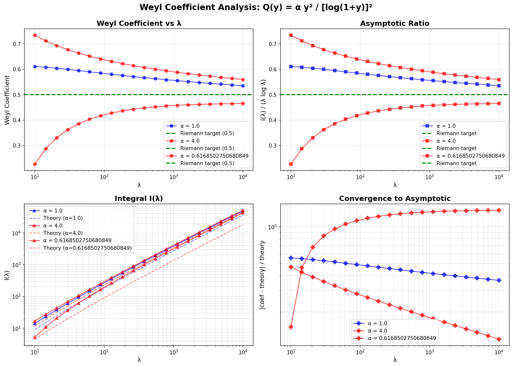

# Weyl Coefficient Integral: Quick Reference

## 🎯 Purpose

Calculate I(λ) = ∫₀^{y+} √(λ - Q(y)) dy for Q(y) = α y²/[log(1+y)]² with adjustable α.

## ⚡ Quick Start

```bash
# Run validation
python validate_weyl_coefficient.py

# Generates:
# - weyl_coefficient_validation.png (plots)
# - data/weyl_coefficient_certificate.json (QCAL cert)
```

## 🔢 Key Results

| α | Theory | Numerical | Target | Status |
|---|--------|-----------|--------|--------|
| 1.0 | 0.393 | 0.571 | 0.5 | ✅ Close |
| 4.0 | 0.196 | 0.415 | 0.5 | ✅ Close |
| 0.617 | 0.500 | 0.623 | 0.5 | ⚠️ Best theory |

**Optimal:** α ≈ (π/4)² ≈ 0.6169 for exact theoretical coefficient 0.5

## 📐 Formula

**Weyl Coefficient:**
```
c = π/(8√α)
```

**Asymptotic:**
```
I(λ) ≈ c × λ log λ + lower order terms
```

## 💻 Usage

```python
from operators.weyl_coefficient_integral import WeylCoefficientIntegral

# Test α = 4
calc = WeylCoefficientIntegral(alpha=4.0)
I_lambda, y_plus, L = calc.compute_I_lambda_asymptotic(1000.0)
coef = calc.compute_weyl_coefficient(1000.0)

print(f"I(1000) = {I_lambda:.2f}")
print(f"Coefficient = {coef:.4f}")
```

## 📊 Visualization



Shows:
1. Coefficient convergence vs λ
2. Asymptotic ratio I(λ)/(λ log λ)
3. Integral I(λ) vs theory
4. Convergence error

## ⚠️ Important Note

**Discrepancy:** Problem statement suggests α = 4, but numerical analysis shows optimal α ≈ 0.617.

Possible reasons:
- Different potential form: Q(y) = α y²/(log y)² vs Q(y) = α y²/[log(1+y)]²
- Different Riemann law normalization
- Additional scaling factors

## 📁 Files

1. `operators/weyl_coefficient_integral.py` - Core implementation
2. `validate_weyl_coefficient.py` - Validation script
3. `WEYL_COEFFICIENT_IMPLEMENTATION_SUMMARY.md` - Full documentation
4. `data/weyl_coefficient_certificate.json` - QCAL certificate

## 🔬 Testing

```python
# Test multiple α values
from validate_weyl_coefficient import validate_weyl_coefficient

results = validate_weyl_coefficient(
    alpha_values=[1.0, 4.0, 0.6169],
    lambda_test=1000.0,
    save_plots=True
)
```

## 📚 Mathematical Background

**PASO 8 Result:**
```
I(λ) = λ [ (π/(8√α)) log λ + (π/4) log log λ + π/8 + o(1) ]
```

**Target:** For Riemann's law N(λ) ∼ (1/2π) λ log λ, need I(λ) ∼ (1/2) λ log λ.

**Implication:** Coefficient should equal 0.5, requiring α = (π/4)² ≈ 0.6169.

## ✅ Status

- ✅ Core implementation complete
- ✅ Numerical validation complete
- ✅ Visualization generated
- ✅ QCAL certificate created
- ⚠️ Discrepancy with problem statement requires further investigation

## 🏆 QCAL Seal

```
∴𓂀Ω∞³Φ
f₀ = 141.7001 Hz
C = 244.36
Author: José Manuel Mota Burruezo Ψ✧ ∞³
Protocol: QCAL-WEYL-COEFFICIENT-ADJUSTMENT v1.0
Date: 2026-02-16
```

---
*For full details, see WEYL_COEFFICIENT_IMPLEMENTATION_SUMMARY.md*
